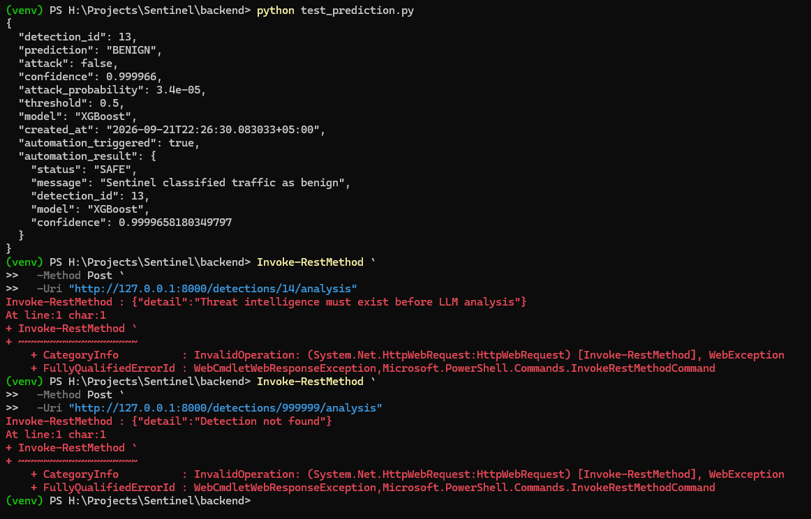

# Sentinel

Sentinel is an end-to-end network intrusion detection and cybersecurity automation platform built with machine learning, FastAPI, PostgreSQL, n8n, external threat intelligence, and LLM-assisted incident analysis.

The project began as a binary CIC-IDS2017 intrusion classifier and is being expanded phase-by-phase into a complete detection, persistence, enrichment, analysis, approval, response, monitoring, and deployment system.

---

## Current Status

| Phase | Description | Status |
|---|---|---|
| 1 | ML Training & Evaluation | Complete |
| 2 | FastAPI Model Serving | Complete |
| 3 | PostgreSQL Persistence | Complete |
| 4 | n8n Automation Foundation | Complete |
| 5 | FastAPI -> n8n Integration | Complete |
| 6 | Threat Intelligence Enrichment | Complete |
| 7 | LLM Incident Analysis | Complete |
| 8 | Human Approval & Automated Response | Next |
| 9 | Real-Time Detection System & Dashboard | Planned |
| 10 | Full Validation & Deployment Readiness | Planned |

---

## What Sentinel Does Today

Sentinel can currently:

- load a trained XGBoost intrusion-detection model
- accept a 77-feature network-flow payload through FastAPI
- accept optional network metadata beside the ML feature vector
- classify traffic as `BENIGN` or `ATTACK`
- return attack probability and confidence
- persist detections in PostgreSQL
- store source/destination IPs, ports, protocol, and observation time
- retrieve and filter detection history
- automatically trigger a published n8n workflow after prediction
- route ATTACK and BENIGN events through separate automation branches
- enrich ATTACK events with AbuseIPDB source-IP reputation data
- persist threat-intelligence results back into PostgreSQL
- reject threat enrichment for BENIGN detections
- send enriched ATTACK incidents to Google Gemini for structured analysis
- validate LLM output with Pydantic
- persist LLM provider, model, status, analysis JSONB, errors, and timestamps
- return a combined ATTACK response containing ML, network, threat-intelligence, and LLM analysis data
- keep BENIGN traffic on the original SAFE path without calling AbuseIPDB or Gemini

---

## Current Architecture

```text
                 Network Flow / Event
                         |
              +----------+----------+
              |                     |
              v                     v
      77 ML Features          Network Metadata
              |              IPs, ports, protocol,
              |                 observed time
              +----------+----------+
                         |
                         v
                      FastAPI
                         |
                         v
                      XGBoost
                         |
                         v
                 BENIGN / ATTACK
                         |
                         v
                    PostgreSQL
                         |
                         v
                        n8n
                         |
                  attack == true?
                    /         \
                  NO           YES
                  |             |
                  v             v
                SAFE      AbuseIPDB Lookup
                                |
                                v
                       Threat Enrichment
                                |
                                v
                    Save Threat Intelligence
                                |
                                v
                      LLM Incident Analysis
                                |
                                v
                    Pydantic Validation
                                |
                                v
                    Save LLM Analysis
                                |
                                v
                    Combined Incident Response
```

The XGBoost model still receives exactly 77 numeric ML features. Network metadata, threat intelligence, and LLM analysis are kept as separate layers.

---

## Validation Evidence

The screenshots below are from actual local development runs during Phase 7.

### Gemini API connection

Sentinel successfully connected to the Gemini API and received a real model response.


### Full n8n ATTACK pipeline

The production ATTACK branch completed through AbuseIPDB enrichment, persistence, Gemini incident analysis, and the final webhook response.


### Structured LLM incident result

A controlled ATTACK test returned a complete structured incident analysis with severity, reasoning, risk factors, likely activity, recommended actions, and analyst notes.


### Safety and regression validation

Phase 7 validation confirmed that BENIGN traffic stays on the SAFE branch, ATTACK detections without threat intelligence are rejected, and nonexistent detection IDs return `404`.



---

## Phase 7: LLM Incident Analysis

Phase 7 adds a structured AI analysis layer on top of Sentinel's ML result and AbuseIPDB enrichment.

The LLM does not replace XGBoost or threat intelligence. It receives the trusted incident context already stored by Sentinel and produces a structured analyst-oriented interpretation.

Current development provider:

```text
Google Gemini
gemini-3.5-flash-lite
```

The output schema includes:

```text
severity
severity_reason
summary
likely_activity
reasoning
risk_factors
recommended_actions
analyst_note
```

The final production response distinguishes:

```text
status = ATTACK_DETECTED
```

from:

```text
incident_analysis.severity = LOW / MEDIUM / HIGH / CRITICAL
```

This allows Sentinel to record that the ML detector raised an ATTACK while still allowing the analysis layer to assess the overall incident severity after considering threat-intelligence evidence.

---

## Technology Stack

### Machine Learning

- Python
- XGBoost
- Random Forest
- K-Nearest Neighbors
- CNN / Keras
- scikit-learn
- NumPy
- Pandas
- Joblib

### Backend

- FastAPI
- Uvicorn
- Pydantic
- httpx
- Google GenAI SDK

### Database

- PostgreSQL
- SQLAlchemy
- psycopg
- JSONB

### Automation & Threat Intelligence

- n8n
- Webhooks
- Conditional routing
- HTTP integrations
- AbuseIPDB
- Google Gemini

### Development / Tooling

- Git / GitHub
- Jupyter / Google Colab
- Python virtual environments
- pgAdmin

---

## Machine Learning

Sentinel Phase 1 used the CIC-IDS2017 dataset for binary intrusion detection.

Binary labels:

```text
BENIGN -> 0
ATTACK -> 1
```

The final production feature contract contains **77 numeric network-flow features**.

Four models were trained:

- Random Forest
- XGBoost
- K-Nearest Neighbors
- CNN

XGBoost was selected as the production inference model.

Production model:

```text
ML Models/XGBoost/sentinel_xgboost_binary_v1.json
```

---

## Project Structure

```text
Sentinel/
|-- .gitignore
|-- README.md
|
|-- Dataset/
|   `-- Dataset_README.md
|
|-- ML Models/
|   |-- CNN/
|   |-- KNN/
|   |-- Random Forest/
|   `-- XGBoost/
|
|-- backend/
|   |-- app/
|   |   |-- main.py
|   |   |-- database.py
|   |   |-- models.py
|   |   `-- services/
|   |       |-- automation.py
|   |       `-- llm_analysis.py
|   |-- test_prediction.py
|   |-- test_n8n_connection.py
|   `-- .gitignore
|
|-- automation/
|   `-- sentinel_detection_automation.json
|
`-- docs/
    |-- assets/
    |   |-- readme/
    |   `-- phase 6/
    |-- Sentinel_Phase_01_ML_Training.md
    |-- Sentinel_Phase_02_Model_Serving.md
    |-- Sentinel_Phase_03_Database_Persistence.md
    |-- Sentinel_Phase_04_n8n_Automation_Foundation.md
    |-- Sentinel_Phase_05_FastAPI_n8n_Integration.md
    |-- Sentinel_Phase_06_Threat_Intelligence_Enrichment.md
    `-- Sentinel_Phase_07_LLM_Incident_Analysis.md
```

---

## Repository Notes

Large generated artifacts are intentionally excluded from Git.

### CIC-IDS2017 dataset archive

The raw dataset ZIP is excluded.

See:

```text
Dataset/Dataset_README.md
```

### KNN binary

The trained KNN model is approximately 1 GB and is excluded.

See:

```text
ML Models/KNN/KNN_README.md
```

### Random Forest binary

The trained Random Forest binary is excluded to keep the repository lightweight.

See:

```text
ML Models/Random Forest/RandomForest_README.md
```

Secrets such as:

```text
backend/.env
GEMINI_API_KEY
AbuseIPDB API key
database password
```

are not committed.

The AbuseIPDB key is stored using n8n Credentials and the Gemini key is loaded from the backend environment.

---

## Environment Variables

Create:

```text
backend/.env
```

with local values:

```env
DB_USER=postgres
DB_PASSWORD=your_password
DB_HOST=localhost
DB_PORT=5432
DB_NAME=sentinel_db

N8N_WEBHOOK_URL=http://localhost:5678/webhook/sentinel-detection
GEMINI_API_KEY=your_gemini_key
```

Do not commit `.env`.

---

## Running Sentinel

Start PostgreSQL, then start FastAPI from:

```text
Sentinel/backend
```

with:

```powershell
uvicorn app.main:app --reload
```

FastAPI:

```text
http://127.0.0.1:8000
```

Swagger:

```text
http://127.0.0.1:8000/docs
```

Start n8n separately:

```powershell
n8n
```

n8n:

```text
http://localhost:5678
```

---

## Main API Endpoints

```http
GET  /
GET  /health
GET  /model-info
POST /predict
GET  /detections
GET  /detections/{detection_id}
POST /detections/{detection_id}/enrichment
POST /detections/{detection_id}/analysis
```

The analysis endpoint verifies that the detection exists, is an ATTACK, and has threat intelligence before sending trusted incident context to Gemini. It validates and persists the structured result, and records provider failures without deleting the original incident.

---

## n8n Automation

The current published workflow performs:

```text
Webhook
   |
   v
IF attack?
   |
   +-- FALSE --> Prepare Benign Result --> Respond SAFE
   |
   `-- TRUE
         |
         v
      Check Source IP Reputation
         |
         v
      Prepare Attack Alert
         |
         v
      Save Threat Intelligence
         |
         v
      Analyze Incident with LLM
         |
         v
      Respond with Combined ATTACK Incident
```

The exported workflow is stored at:

```text
automation/sentinel_detection_automation.json
```

---

## LLM Failure Handling

Sentinel does not discard an incident when the external LLM provider fails.

The analysis state can be:

```text
NOT_STARTED
PENDING
COMPLETED
FAILED
```

When an LLM request fails:

```text
analysis_status = FAILED
analysis_error = provider or validation error
```

The original ML detection and threat-intelligence data remain intact.

During Phase 7 development, Gemini temporarily returned a `503 UNAVAILABLE` high-demand response. Sentinel captured the provider error correctly and preserved the detection. A lower-demand free-tier development model was then used successfully.

---

## Phase Documentation

Every completed phase has a dedicated technical record under `docs/`.

Completed documentation currently covers Phases 1 through 7.

---

## Roadmap

### Phase 1 - ML Training & Evaluation

Complete.

### Phase 2 - FastAPI Model Serving

Complete.

### Phase 3 - PostgreSQL Persistence

Complete.

### Phase 4 - n8n Automation Foundation

Complete.

### Phase 5 - FastAPI to n8n Integration

Complete.

### Phase 6 - Threat Intelligence Enrichment

Complete.

### Phase 7 - LLM Incident Analysis

Complete. Adds structured Gemini-based incident analysis, Pydantic validation, PostgreSQL persistence, failure tracking, and n8n integration.

### Phase 8 - Human Approval & Automated Response

**Next.** Add human approval and rejection workflows before potentially disruptive response actions.

### Phase 9 - Real-Time Detection System & Dashboard

Add live traffic/flow ingestion, automatic inference, incident feeds, analytics, and dashboard views.

### Phase 10 - Full Validation & Deployment Readiness

Perform end-to-end validation using real benign and attack traffic, service-failure testing, reliability checks, deployment hardening, and final release preparation.

---

## Project Goal

Sentinel is intended to evolve into:

> **An AI-powered network threat detection and automated incident-response platform that combines machine learning, event persistence, threat intelligence, LLM-assisted analysis, automation, and human-supervised response workflows.**

---

## Dataset

Sentinel uses the **CIC-IDS2017** dataset published by the Canadian Institute for Cybersecurity, University of New Brunswick.

Official dataset page:

https://www.unb.ca/cic/datasets/ids-2017.html

See:

```text
Dataset/Dataset_README.md
```

for dataset and reproduction notes.

---

## License

A license has not yet been selected.
