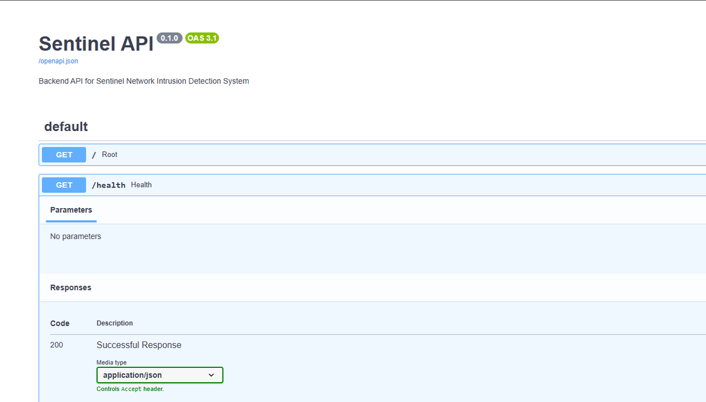
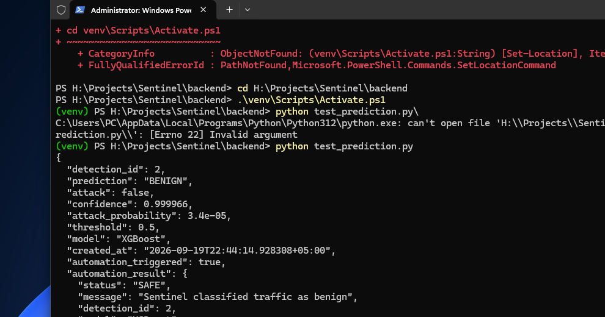
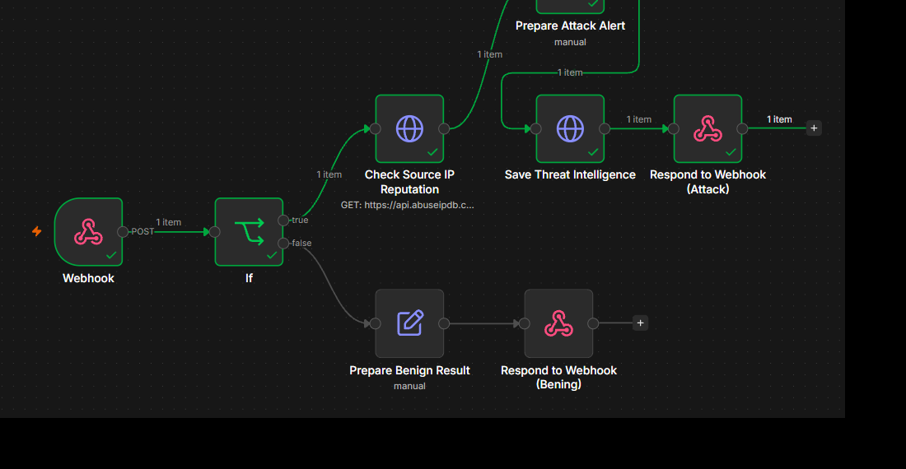
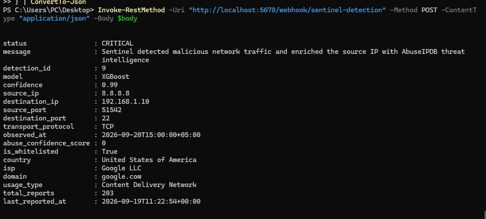
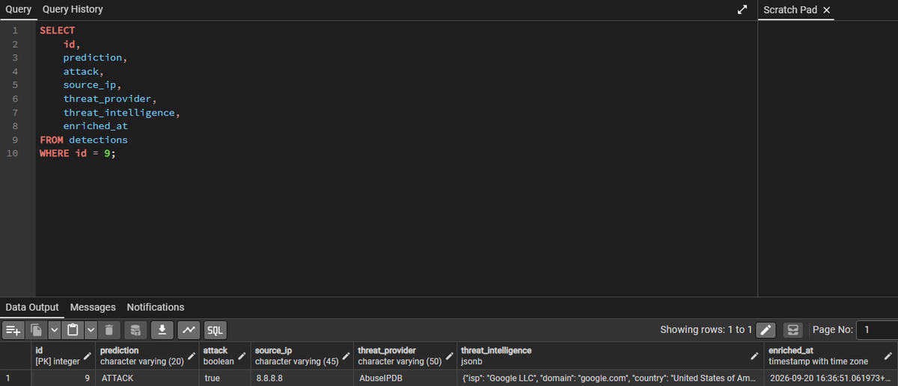
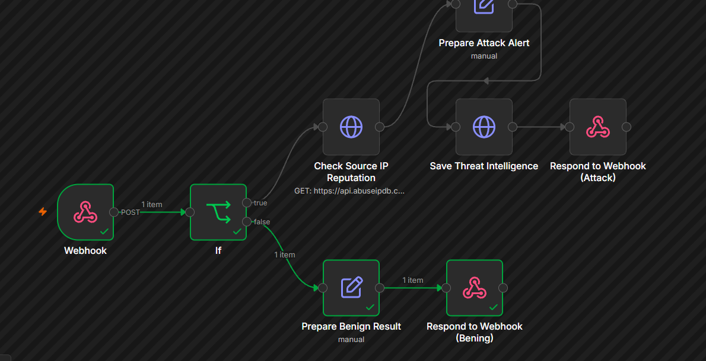

# Sentinel

Sentinel is an end-to-end network intrusion detection and cybersecurity automation platform built with machine learning, FastAPI, PostgreSQL, n8n, and external threat intelligence.

The project began as a binary CIC-IDS2017 intrusion classifier and is being expanded phase-by-phase into a complete detection, persistence, enrichment, analysis, and response system.

---

## Current Status

| Phase | Description | Status |
|---|---|---|
| 1 | ML Training & Evaluation | Complete |
| 2 | FastAPI Model Serving | Complete |
| 3 | PostgreSQL Persistence | Complete |
| 4 | n8n Automation Foundation | Complete |
| 5 | FastAPI -> n8n Integration | Complete |
| 6 | Threat Intelligence Enrichment | Complete |
| 7 | LLM Incident Analysis | Next |
| 8 | Human Approval & Automated Response | Planned |
| 9 | Real-Time Detection System & Dashboard | Planned |
| 10 | Full Validation & Deployment Readiness | Planned |

---

## What Sentinel Does Today

Sentinel can currently:

- load a trained XGBoost intrusion-detection model
- accept a 77-feature network-flow payload through FastAPI
- accept optional network metadata beside the ML feature vector
- classify traffic as `BENIGN` or `ATTACK`
- return attack probability and confidence
- persist detections in PostgreSQL
- preserve the original 77-feature payload as JSONB
- store source/destination IPs, ports, protocol, and observation time
- retrieve and filter detection history
- automatically trigger a published n8n workflow after prediction
- route ATTACK and BENIGN events through separate automation branches
- enrich ATTACK events with AbuseIPDB source-IP reputation data
- persist threat-intelligence results back into PostgreSQL
- reject threat enrichment for BENIGN detections
- return a rich CRITICAL incident for ATTACK events
- return a SAFE automation response for BENIGN events

---

## Current Architecture

```text
                 Network Flow / Event
                         |
              +----------+----------+
              |                     |
              v                     v
      77 ML Features          Network Metadata
              |              IPs, ports, protocol,
              |                 observed time
              +----------+----------+
                         |
                         v
                      FastAPI
                         |
                         v
                      XGBoost
                         |
                         v
                 BENIGN / ATTACK
                         |
                         v
                    PostgreSQL
                         |
                         v
                        n8n
                         |
                  attack == true?
                    /         \
                  NO           YES
                  |             |
                  v             v
                SAFE      AbuseIPDB Lookup
                                |
                                v
                       Enriched Incident
                                |
                                v
                    Save Threat Intelligence
                                |
                                v
                              FastAPI
                                |
                                v
                           PostgreSQL
                                |
                                v
                    Rich CRITICAL Response
```

The XGBoost model still receives exactly 77 ML features. Network identifiers are carried as metadata and are not fed into the model.

---

## Validation Evidence

The screenshots below are from actual local development runs during the completed phases. They are included to make the repository implementation verifiable rather than documentation-only.

### FastAPI model-serving API

The backend exposes the Sentinel API through FastAPI and Swagger.



### FastAPI -> PostgreSQL -> n8n integration

A real backend prediction produced a persisted detection and successfully triggered the automation workflow.



### Published ATTACK enrichment workflow

The ATTACK branch performs an AbuseIPDB source-IP lookup, prepares an enriched incident, saves the threat intelligence, and returns the response.



### Enriched ATTACK response

A controlled integration test returned network metadata and AbuseIPDB context through the production webhook.



The public IP used in this integration test was only a test target. The returned reputation showed a whitelist result and an abuse confidence score of 0. The CRITICAL state came from the deliberately fabricated ATTACK event used to exercise the pipeline.

### Threat-intelligence persistence

The same ATTACK record was updated in PostgreSQL with the provider, JSONB enrichment payload, and enrichment timestamp.



### BENIGN regression validation

After the Phase 6 changes, BENIGN traffic still bypassed the threat-intelligence branch and followed the original SAFE path.



---

## Technology Stack

### Machine Learning

- Python
- XGBoost
- Random Forest
- K-Nearest Neighbors
- CNN / Keras
- scikit-learn
- NumPy
- Pandas
- Joblib

### Backend

- FastAPI
- Uvicorn
- Pydantic
- httpx

### Database

- PostgreSQL
- SQLAlchemy
- psycopg
- JSONB

### Automation & Threat Intelligence

- n8n
- Webhooks
- Conditional routing
- HTTP integrations
- AbuseIPDB

### Development / Tooling

- Git / GitHub
- Jupyter / Google Colab
- Python virtual environments
- pgAdmin

---

## Machine Learning

Sentinel Phase 1 used the CIC-IDS2017 dataset for binary intrusion detection.

Binary labels:

```text
BENIGN -> 0
ATTACK -> 1
```

The final production feature contract contains **77 numeric network-flow features**.

Four models were trained:

- Random Forest
- XGBoost
- K-Nearest Neighbors
- CNN

XGBoost was selected as the initial production inference model.

The production model used by the backend is:

```text
ML Models/XGBoost/sentinel_xgboost_binary_v1.json
```

The complete training and evaluation record is documented in:

```text
docs/Sentinel_Phase_01_ML_Training.md
```

---

## Project Structure

```text
Sentinel/
|-- .gitignore
|-- README.md
|
|-- Dataset/
|   `-- Dataset_README.md
|
|-- ML Models/
|   |-- CNN/
|   |-- KNN/
|   |-- Random Forest/
|   `-- XGBoost/
|
|-- backend/
|   |-- app/
|   |   |-- main.py
|   |   |-- database.py
|   |   |-- models.py
|   |   `-- services/
|   |       `-- automation.py
|   |-- test_prediction.py
|   |-- test_n8n_connection.py
|   `-- .gitignore
|
|-- automation/
|   `-- sentinel_detection_automation.json
|
`-- docs/
    |-- assets/
    |   `-- readme/
    |-- Sentinel_Phase_01_ML_Training.md
    |-- Sentinel_Phase_02_Model_Serving.md
    |-- Sentinel_Phase_03_Database_Persistence.md
    |-- Sentinel_Phase_04_n8n_Automation_Foundation.md
    |-- Sentinel_Phase_05_FastAPI_n8n_Integration.md
    `-- Sentinel_Phase_06_Threat_Intelligence_Enrichment.md
```

---

## Repository Notes

Large generated artifacts are intentionally excluded from Git.

### CIC-IDS2017 dataset archive

The raw dataset ZIP is excluded.

See:

```text
Dataset/Dataset_README.md
```

### KNN binary

The trained KNN model is approximately 1 GB and is excluded.

See:

```text
ML Models/KNN/KNN_README.md
```

### Random Forest binary

The trained Random Forest binary is also excluded to keep the repository lightweight.

See:

```text
ML Models/Random Forest/RandomForest_README.md
```

Secrets such as:

```text
backend/.env
AbuseIPDB API key
database password
```

are not committed.

The AbuseIPDB key is stored using n8n Credentials.

---

## Backend Setup

Create and activate a virtual environment:

```powershell
cd backend
python -m venv venv
.\venv\Scripts\Activate.ps1
```

Install the required Python dependencies for the backend and ML runtime.

Current core dependencies include:

```text
fastapi
uvicorn[standard]
xgboost
scikit-learn
joblib
numpy
pandas
sqlalchemy
psycopg[binary]
python-dotenv
httpx
```

---

## Environment Variables

Create:

```text
backend/.env
```

with local values:

```env
DB_USER=postgres
DB_PASSWORD=your_password
DB_HOST=localhost
DB_PORT=5432
DB_NAME=sentinel_db

N8N_WEBHOOK_URL=http://localhost:5678/webhook/sentinel-detection
```

Do not commit `.env`.

---

## Running Sentinel

Start PostgreSQL, then start the FastAPI backend from:

```text
Sentinel/backend
```

with:

```powershell
uvicorn app.main:app --reload
```

FastAPI:

```text
http://127.0.0.1:8000
```

Swagger:

```text
http://127.0.0.1:8000/docs
```

Start n8n separately:

```powershell
n8n
```

n8n:

```text
http://localhost:5678
```

---

## Main API Endpoints

```http
GET  /
GET  /health
GET  /model-info
POST /predict
GET  /detections
GET  /detections/{detection_id}
POST /detections/{detection_id}/enrichment
```

The detection history endpoint supports filtering by attack status.

The enrichment endpoint is used by the n8n ATTACK workflow to write threat-intelligence results back into the existing detection.

---

## Prediction Input

Sentinel separates model features from network metadata:

```json
{
  "features": {
    "Protocol": 6,
    "Flow Duration": 12345
  },
  "metadata": {
    "source_ip": "203.0.113.50",
    "destination_ip": "192.168.1.10",
    "source_port": 51542,
    "destination_port": 22,
    "transport_protocol": "TCP",
    "observed_at": "2026-09-20T13:05:00+05:00"
  }
}
```

A real inference request requires all 77 production feature names.

Metadata is optional and is not passed to XGBoost.

---

## Threat Intelligence

ATTACK detections can be enriched through AbuseIPDB.

The workflow can attach context such as:

```text
abuse_confidence_score
is_whitelisted
country
isp
domain
usage_type
total_reports
last_reported_at
```

Threat intelligence is persisted using:

```text
threat_provider
threat_intelligence
enriched_at
```

`threat_intelligence` is stored as PostgreSQL JSONB so Sentinel can later support additional providers without adding a dedicated SQL column for every provider-specific property.

---

## n8n Automation

The published workflow currently performs:

```text
Webhook
   |
   v
IF attack?
   |
   +-- FALSE --> Prepare Benign Result --> Respond SAFE
   |
   `-- TRUE
         |
         v
      Check Source IP Reputation
         |
         v
      Prepare Attack Alert
         |
         v
      Save Threat Intelligence
         |
         v
      Respond with Enriched CRITICAL Incident
```

The production webhook is:

```text
POST /webhook/sentinel-detection
```

The exported workflow is stored at:

```text
automation/sentinel_detection_automation.json
```

---

## Phase Documentation

Every completed phase has a dedicated technical record under `docs/`.

These documents cover:

- objectives
- architecture
- implementation
- files changed
- testing
- problems encountered
- concepts learned
- transition to the next phase

Completed documentation currently covers Phases 1 through 6.

---

## Roadmap

### Phase 1 - ML Training & Evaluation

Complete.

### Phase 2 - FastAPI Model Serving

Complete.

### Phase 3 - PostgreSQL Persistence

Complete.

### Phase 4 - n8n Automation Foundation

Complete.

### Phase 5 - FastAPI to n8n Integration

Complete.

### Phase 6 - Threat Intelligence Enrichment

Complete. Adds network metadata, AbuseIPDB reputation checks, enriched incidents, database write-back, and BENIGN safety validation.

### Phase 7 - LLM Incident Analysis

**Next.** Add LLM-assisted incident summaries, context interpretation, severity reasoning, and recommended actions.

### Phase 8 - Human Approval & Automated Response

Add approval and rejection workflows before potentially disruptive actions.

### Phase 9 - Real-Time Detection System & Dashboard

Add live traffic/flow ingestion, automatic inference, incident feeds, analytics, and dashboard views.

### Phase 10 - Full Validation & Deployment Readiness

Perform end-to-end validation using real benign and attack traffic, service-failure testing, reliability checks, and deployment hardening.

---

## Project Goal

Sentinel is intended to evolve into:

> **An AI-powered network threat detection and automated incident-response platform that combines machine learning, event persistence, threat intelligence, LLM-assisted analysis, automation, and human-supervised response workflows.**

---

## Dataset

Sentinel uses the **CIC-IDS2017** dataset published by the Canadian Institute for Cybersecurity, University of New Brunswick.

Official dataset page:

https://www.unb.ca/cic/datasets/ids-2017.html

See:

```text
Dataset/Dataset_README.md
```

for dataset and reproduction notes.

---

## License

A license has not yet been selected.

Before a broader public release, an appropriate license should be chosen based on whether Sentinel remains portfolio-only, becomes open source, or evolves into a commercial project.
