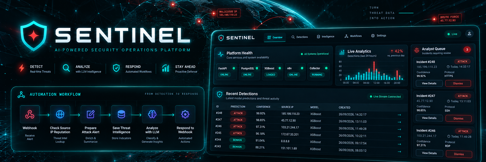
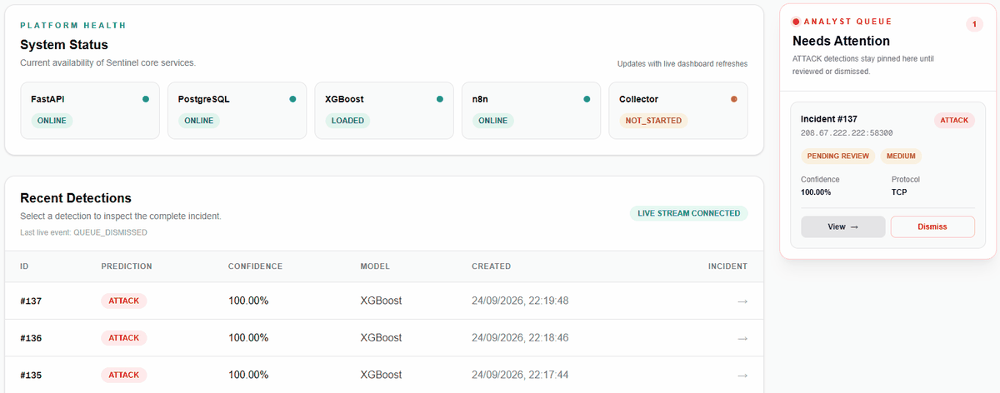
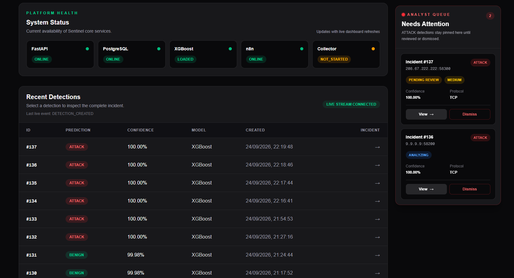
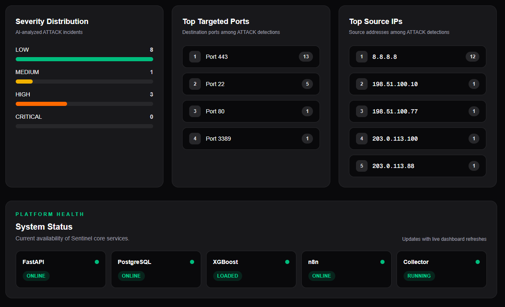

<p align="center">
  
</p>

# Sentinel

Sentinel is a real-time network intrusion detection and incident-response platform that combines machine learning, live traffic collection, threat-intelligence enrichment, LLM-assisted analysis, automation, and human review in one workflow.

## Tech Stack

| Layer | Technology |
|---|---|
| Machine Learning | Python, XGBoost, CIC-IDS2017 |
| Live Collection | Scapy, Npcap |
| Backend | FastAPI, Pydantic, SQLAlchemy, Uvicorn |
| Database | PostgreSQL, psycopg, JSONB |
| Automation | n8n, Webhooks |
| Threat Intelligence | AbuseIPDB |
| LLM Analysis | Google Gemini |
| Dashboard | Next.js, React, TypeScript, Tailwind CSS |
| Live Updates | WebSockets |
| Tooling | Git, GitHub, pgAdmin |

## Development Phases

| Phase | Name |
|---|---|
| 1 | ML Training & Evaluation |
| 2 | FastAPI Model Serving |
| 3 | PostgreSQL Persistence |
| 4 | n8n Automation Foundation |
| 5 | FastAPI → n8n Integration |
| 6 | Threat Intelligence Enrichment |
| 7 | LLM Incident Analysis |
| 8 | Analyst Dashboard + Human Approval & Response |
| 9 | Real-Time Detection + Live Monitoring & Analytics |
| 10 | Full Validation & Deployment Readiness |

## How Sentinel Works

### 1. Live Detection

The Collector captures live TCP/UDP traffic, groups packets into bidirectional flows, builds the required 77-feature CICFlow-style vector, and submits completed flows to FastAPI.

XGBoost classifies each flow as `BENIGN` or `ATTACK`. Every detection is persisted in PostgreSQL and streamed to the dashboard through WebSockets.

<p align="center">
  
</p>

### 2. Attack Automation

BENIGN detections are persisted and displayed without entering the attack-enrichment pipeline.

ATTACK detections are sent through n8n for threat-intelligence enrichment and LLM analysis before entering the Analyst Queue.

<p align="center">
  
</p>

### 3. Analyst Dashboard

The dashboard provides live detections, service health, confidence scores, incident review, and the Analyst Queue.

Analysts can inspect incidents, approve or reject reviewed incidents, or dismiss an item from the active queue without deleting its stored history.

<p align="center">
  
</p>

### 4. Security Analytics

Sentinel summarizes recent activity through severity distribution, targeted ports, source IPs, detection activity, and platform-health monitoring.

<p align="center">
  
</p>

## Complete Workflow

```text
Live Network Traffic
        |
        v
Npcap + Scapy Collector
        |
        v
Bidirectional Flow Construction
        |
        v
77-Feature Extraction
        |
        v
FastAPI /predict
        |
        v
XGBoost Classification
        |
        v
PostgreSQL Persistence
        |
        v
+-------------------+
|                   |
v                   v
BENIGN            ATTACK
|                   |
v                   v
Dashboard           n8n
                    |
                    v
          AbuseIPDB Reputation Check
                    |
                    v
          Threat Intelligence Stored
                    |
                    v
            Gemini LLM Analysis
                    |
                    v
              Analyst Queue
                    |
                    v
        +-----------+-----------+
        |                       |
        v                       v
     Dismiss               Open Incident
        |                       |
        v                       v
Queue item removed         Human Review
History preserved          /          \
                           v            v
                        REJECT       APPROVE
                           |            |
                           v            v
                     No response   Allowlisted Action
                                        |
                                        v
                              Simulation Execution
                                        |
                                        v
                                Result Persisted
```

`Dismiss` only removes an item from the active Analyst Queue. It does not delete the incident, threat intelligence, analysis, or detection history.

## Using the Repository

### 1. Clone the project

```bash
git clone https://github.com/ushalabs/Sentinel-Cyber-Automation.git
cd Sentinel-Cyber-Automation
```

### 2. Install prerequisites

You will need:

- Python 3.12+
- PostgreSQL
- Node.js and npm
- n8n
- Npcap on Windows for live packet capture
- an AbuseIPDB API key
- a Google Gemini API key

### 3. Prepare the Python environment

```powershell
cd backend
python -m venv venv
.\venv\Scripts\Activate.ps1
```

Install the backend and Collector dependencies:

```powershell
pip install fastapi uvicorn sqlalchemy "psycopg[binary]" python-dotenv pydantic httpx xgboost joblib numpy pandas pyarrow scapy google-genai
```

### 4. Prepare PostgreSQL

Create a local PostgreSQL database named:

```text
sentinel_db
```

Create the database schema required by the current `Detection` model before starting Sentinel.

Then create:

```text
backend/.env
```

with your own local values:

```env
DB_USER=postgres
DB_PASSWORD=your_password
DB_HOST=localhost
DB_PORT=5432
DB_NAME=sentinel_db

N8N_WEBHOOK_URL=http://localhost:5678/webhook/sentinel-detection
GEMINI_API_KEY=your_gemini_key
```

Do not commit `.env`.

### 5. Configure n8n

Start n8n:

```powershell
n8n
```

Open:

```text
http://localhost:5678
```

Import the supplied workflow:

```text
automation/sentinel_detection_automation.json
```

Create your own AbuseIPDB credential inside n8n, attach it to the reputation-check node, and publish the workflow.

The exported workflow contains the workflow structure and credential reference only. It does not include the repository owner's AbuseIPDB API key.

### 6. Start FastAPI

```powershell
cd backend
.\venv\Scripts\Activate.ps1
uvicorn app.main:app --reload
```

API:

```text
http://127.0.0.1:8000
```

Swagger:

```text
http://127.0.0.1:8000/docs
```

### 7. Start the dashboard

In another terminal:

```powershell
cd dashboard
npm install
npm run dev
```

Open:

```text
http://localhost:3000
```

### 8. Configure and start the Collector

The Collector uses the active Windows network interface and local IP configuration. If your machine differs from the development environment, update those values in `collector/collector.py` first.

Run the Collector from an Administrator PowerShell window:

```powershell
cd backend
.\venv\Scripts\Activate.ps1
cd ..\collector
python collector.py
```

Npcap must be installed for live packet capture.

### 9. Use Sentinel

With PostgreSQL, FastAPI, n8n, the dashboard, and Collector running:

```text
Normal traffic
→ Collector
→ XGBoost
→ PostgreSQL
→ Dashboard

ATTACK detection
→ n8n
→ AbuseIPDB
→ Gemini
→ Analyst Queue
→ Human decision
→ Simulated response when approved
```

## Safety Model

Sentinel keeps response execution controlled:

- BENIGN detections do not enter the ATTACK automation pipeline.
- LLM analysis follows threat-intelligence enrichment.
- Response execution requires explicit analyst approval.
- Response actions are restricted to an allowlist.
- Firewall blocking remains simulated rather than disruptive.
- Duplicate request IDs are handled idempotently.
- Secrets remain outside source control.

## Final Validation

The final controlled end-to-end validation completed with:

```text
15 PASS
0 FAIL
```

The validated path covers genuine CIC-IDS2017 attack inference, persistence, n8n automation, AbuseIPDB enrichment, Gemini analysis, Analyst Queue routing, human approval, simulated response execution, failure recovery, and retry protection.

## Dataset

Sentinel uses the CIC-IDS2017 dataset from the Canadian Institute for Cybersecurity, University of New Brunswick.

Dataset and reproduction notes are available under:

```text
Dataset/Dataset_README.md
```

## License

**UshaLabs**
